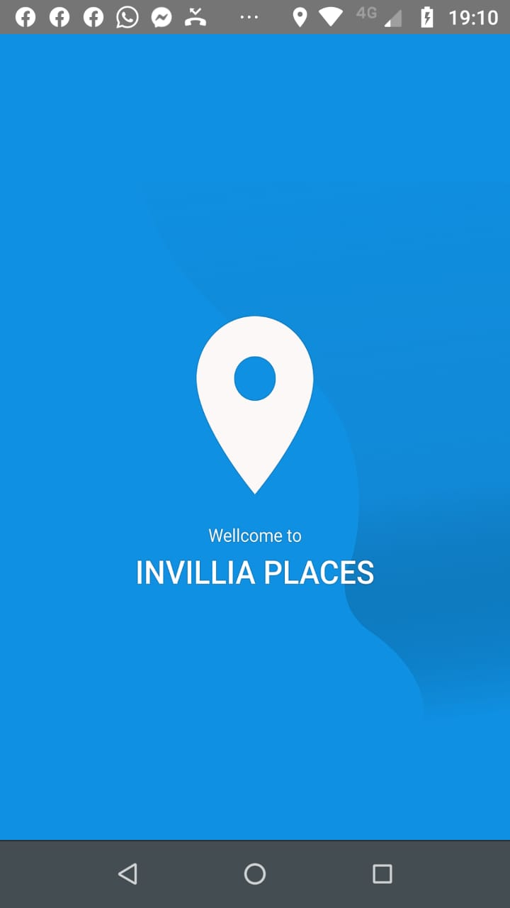
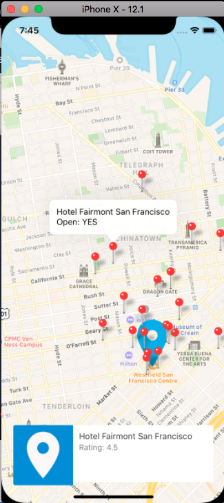
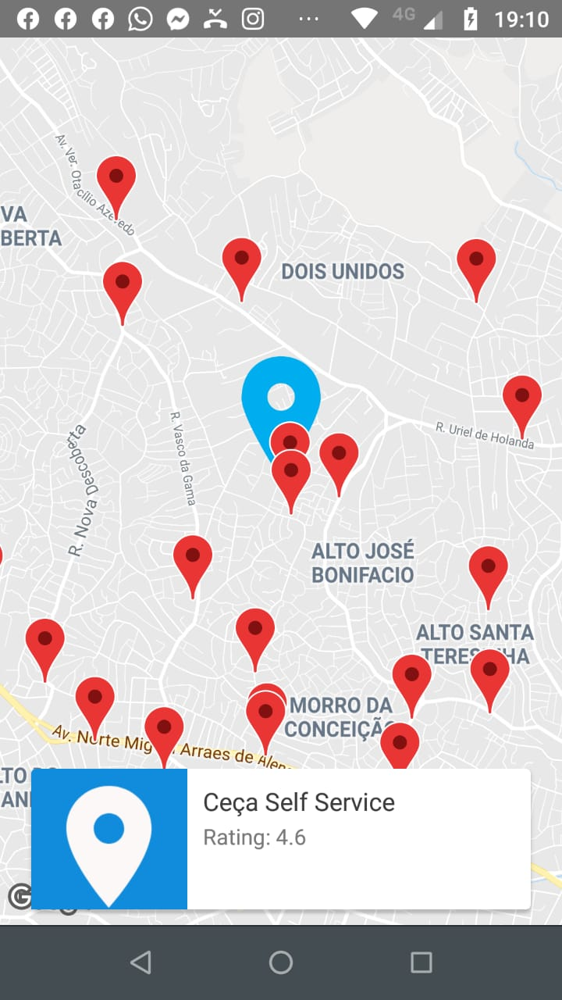

## Project React Native with Maps

This app get your current location and show places next you.
Have a feature listing places in a carousel.

This project was bootstrapped with [React Native CLI](https://facebook.github.io/react-native/docs/getting-started).

## Available Scripts

In the project directory, you can run:

### `yarn` or `npm install`

Install modules of project.

### `react-native run-android` or `react-native run-ios`

Run your project if have device or emulator

### `yarn test` or 'npm test'

Launches the test runner in the interactive watch mode. 

## Print this project

